

  <a href="https://matusvec.github.io">
    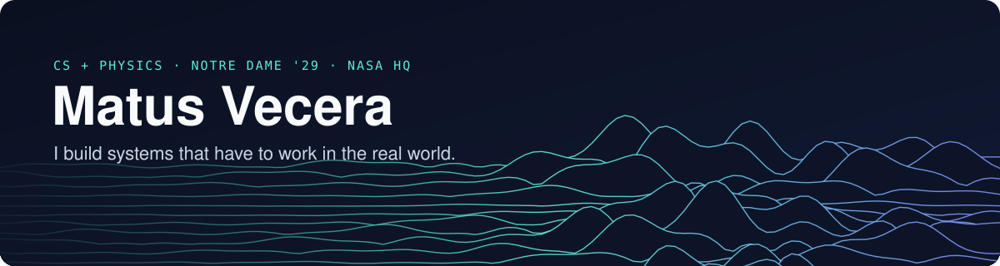
  </a>

  
  
  

I study computer science and physics at Notre Dame, class of 2029. Most of my work right now is in three places: **3D Gaussian splatting** (I've rebuilt a patch of Mars from rover photos and whole rooms from a phone), **reinforcement learning**, and **C++ close to the hardware**. Before that I spent a summer building production software at NASA Headquarters.

  <a href="#nasa">NASA</a> ·
  <a href="#gaussian-splatting">Gaussian splatting</a> ·
  <a href="#machine-learning">Machine learning</a> ·
  <a href="#systems">Systems, graphics, and low-level</a> ·
  <a href="#hardware">Hardware</a> ·
  <a href="#more">More</a>

<table>
  <tr><th colspan="4" align="left">Gaussian splatting and machine learning</th></tr>
  <tr>
    <td width="25%" valign="top"><a href="#planetary-scene-studio">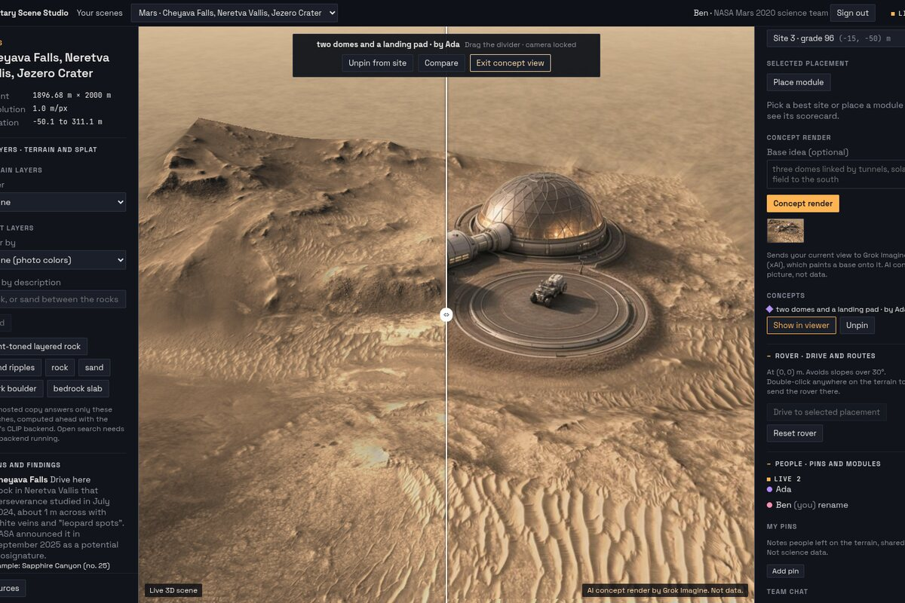</a> <b><a href="#planetary-scene-studio">Planetary Scene Studio</a></b> 🥇 Winner, SpaceXAI track, MHacks 2026 Mars rebuilt from rover photos as a Gaussian splat you can plan a base on.</td>
    <td width="25%" valign="top"><a href="#spatialmind">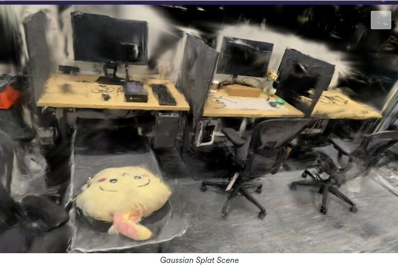</a> <b><a href="#spatialmind">SpatialMind</a></b> 🥈 2nd place, JacHacks 2026 Ask a 3D scene a question in plain language and it points to the answer.</td>
    <td width="25%" valign="top"><a href="#sharks--minnows">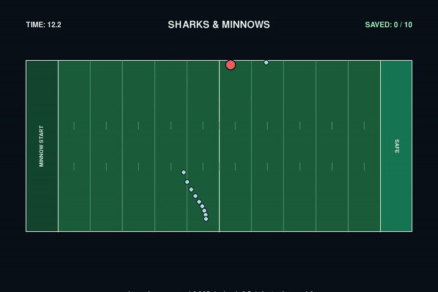</a> <b><a href="#sharks--minnows">Sharks &amp; Minnows</a></b> Multi-agent reinforcement learning A transformer policy that taught itself to use a decoy.</td>
    <td width="25%" valign="top"><a href="#volana">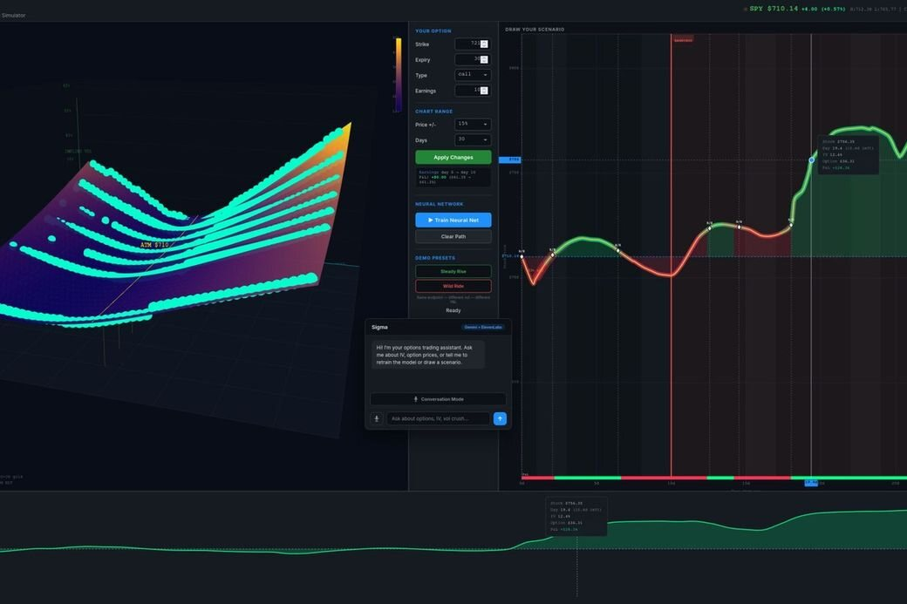</a> <b><a href="#volana">Volana</a></b> 🥇 1st place, WildHacks 2026 Arbitrage-free neural volatility surface, built solo in 24 hours.</td>
  </tr>
  <tr><th colspan="4" align="left">Systems, graphics, and low-level</th></tr>
  <tr>
    <td width="25%" valign="top"><a href="#vecengine">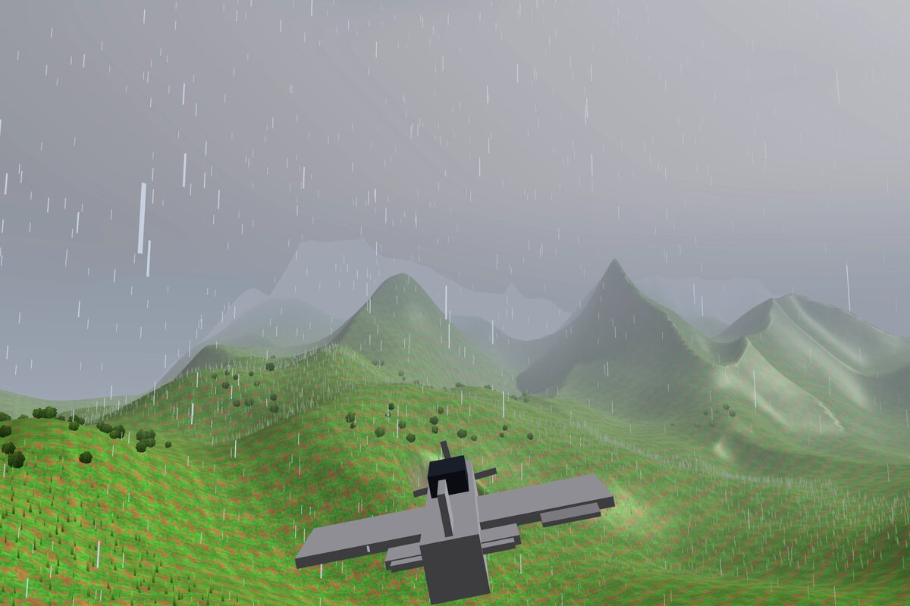</a> <b><a href="#vecengine">vecEngine</a></b> C++17 and OpenGL 3.3, from scratch A 3D engine and flight simulator with no engine underneath.</td>
    <td width="25%" valign="top"><a href="#ember">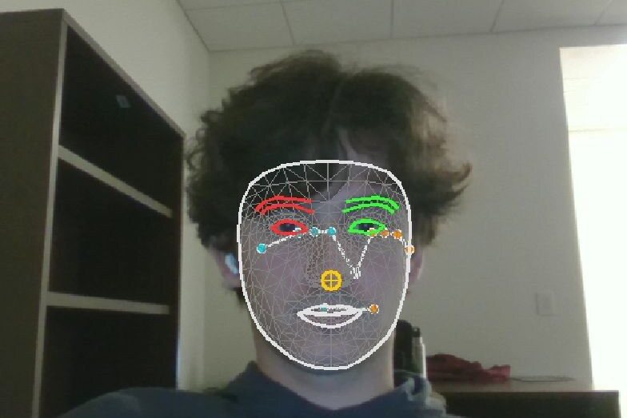</a> <b><a href="#ember">Ember</a></b> 🥇 1st place overall, Hesburgh Hackathon 2026 Run Linux with your face: webcam input injected at the kernel level.</td>
    <td width="25%" valign="top"><a href="#8-bit-cpu-and-hardware-divider">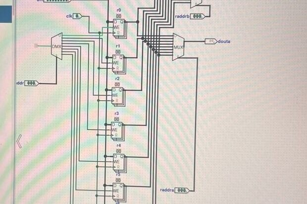</a> <b><a href="#8-bit-cpu-and-hardware-divider">8-bit CPU</a></b> Digital logic, from gates A full CPU and a hardware divider wired by hand.</td>
    <td width="25%" valign="top"><a href="#sentinel">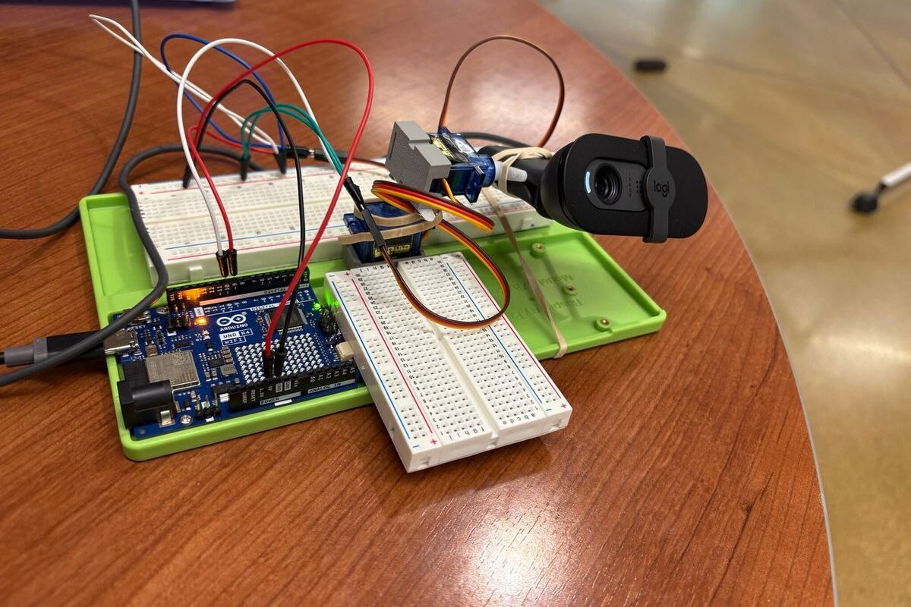</a> <b><a href="#sentinel">Sentinel</a></b> 🏅 Best Use of MongoDB, RocketHacks 2026 A ~$150 vision station that tracks people with a PID gimbal.</td>
  </tr>
</table>

**Summer 2026, Washington, DC**

I worked on EDAQ in close collaboration with colleagues across NASA. It is an analytics system now used by analysts at every NASA center: it answers plain-language questions over agency workforce data with grounded, cited results. I cut end-to-end latency by 41% and took the system through an independent security audit before rollout. Along the way I was flown from the Ames supercomputer to the Hubble control room at Goddard.

  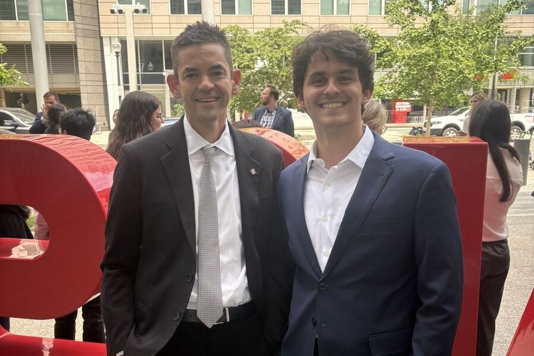
  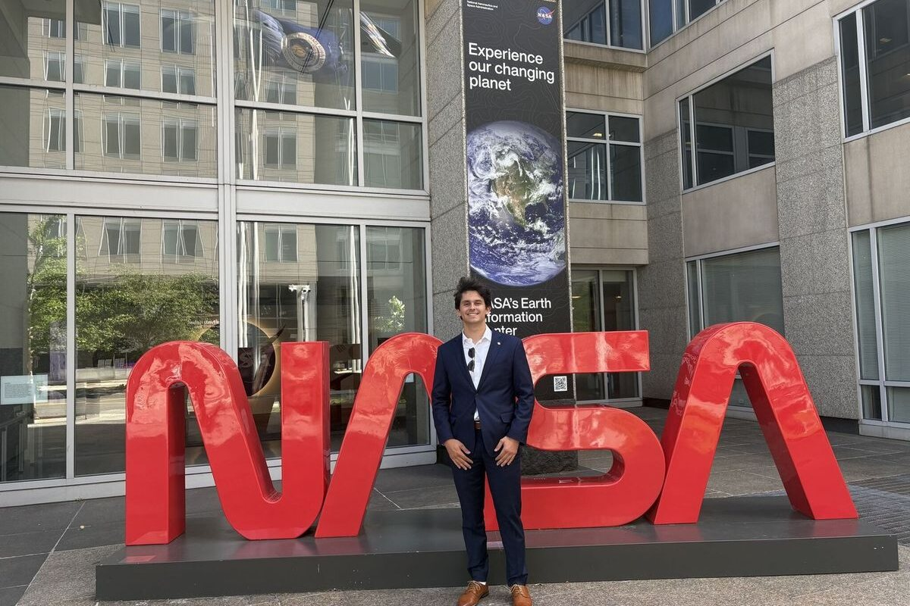
  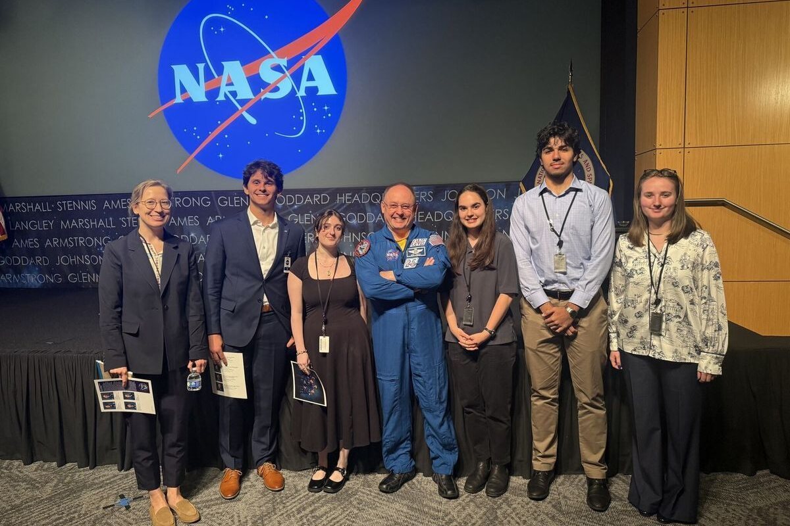

Two of my projects are built on 3D Gaussian splatting: turning ordinary photos into a scene made of millions of oriented, coloured Gaussians that renders in real time. In both, the Gaussians carry more than colour. Semantic features from CLIP and SAM are lifted onto them, so the scene can be searched, labelled, and edited in plain language.

| | [Planetary Scene Studio](#planetary-scene-studio) | [SpatialMind](#spatialmind) |
|:--|:--|:--|
| **Scene** | Cheyava Falls, Jezero Crater, Mars | Real indoor rooms |
| **Gaussians** | 972,047 | 5.2 million |
| **Input** | 241 Perseverance rover photos | Phone capture |
| **Camera poses** | JPL camera models and rover telemetry, no structure-from-motion | COLMAP |
| **Training** | gsplat (MCMC) | 3D Gaussian Splatting with LangSplat |
| **Semantics** | SegFormer terrain classes, SAM + CLIP text search | CLIP features at three scales from SAM masks |
| **Result** | 🥇 Winner, SpaceXAI track, MHacks 2026 | 🥈 2nd place, Agentic AI track, JacHacks 2026 |

### Planetary Scene Studio

**🥇 Winner, SpaceXAI track, MHacks 2026** · [Source](https://github.com/Matusvec/spaceX-Mhacks-Challenge) · [Live](https://planetary-scene-studio.vercel.app)

Plan a base on Mars or the Moon on the real ground, together. From orbit, the sharpest pictures of Mars are 25 cm per pixel, so a 30 cm rock is a single pixel, and a rock that size decides whether a wheel or a landing leg works. Rovers have photographed some places at millimetres per pixel. Planetary Scene Studio puts a photoreal, metric ground site built from those rover photos onto real orbital terrain, then lets a mission team plan on it in one shared session. Built with two teammates.

  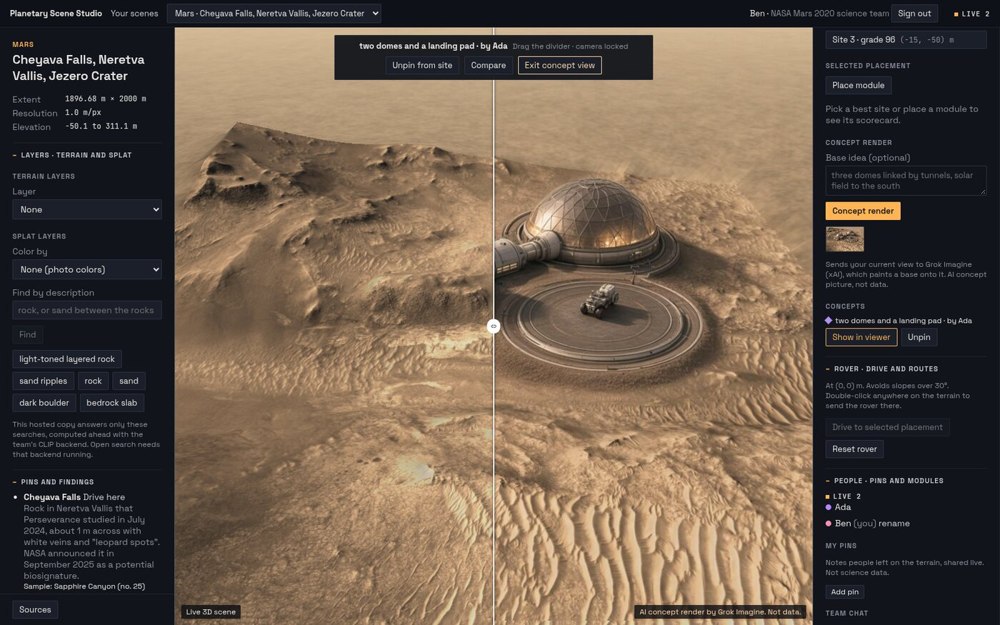

- **A splat from rover photos.** 972,047 Gaussians trained with gsplat from 241 Perseverance photos of Cheyava Falls in Jezero Crater. There is no structure-from-motion: images are undistorted with JPL's camera models, posed from rover telemetry, and three rover stops are registered to within 2 pixels.
- **On real orbital terrain.** The splat sits on 2 km of HiRISE terrain in the same metric frame. Inside the 18 m site, orbit has about 4,000 photo pixels; the splat has nearly a million Gaussians.
- **Semantic layers on every Gaussian.** A SegFormer model trained on AI4Mars labels terrain class, and SAM regions embedded with CLIP power text search like "sand ripples".
- **Plan and drive.** A suitability map grades the terrain, placed habitats get a scorecard, and a six-wheel rocker-bogie rover follows the ground at Perseverance's real top speed of 4.2 cm/s.
- **The Moon too.** Sunlight and Earth visibility at Malapert Massif near the lunar south pole, computed from LOLA terrain and JPL ephemerides.
- **Live multiplayer.** Cursors, pins, modules, rover drives, and team chat sync through SpacetimeDB, with chat, voice, and concept renders through Grok.

`Python` `PyTorch` `gsplat` `SegFormer` `CLIP` `TypeScript` `React` `three.js` `SpacetimeDB`

  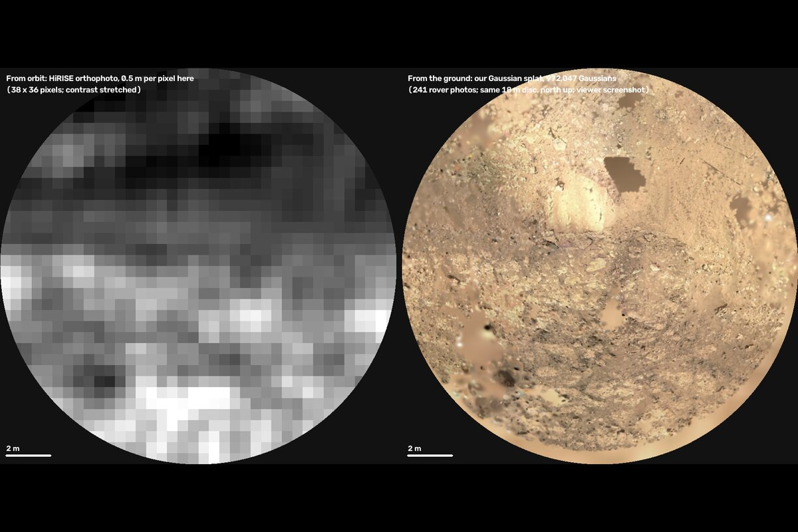
  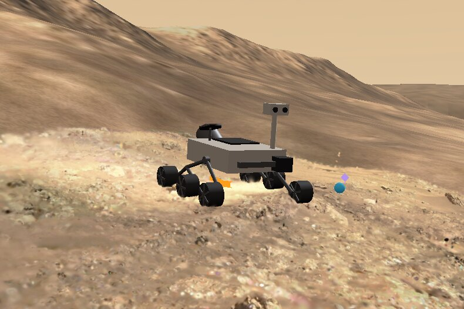
  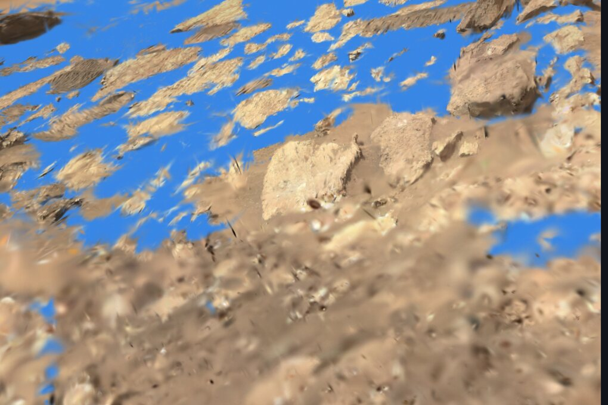

  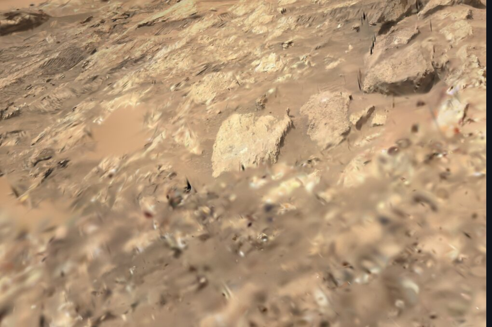
  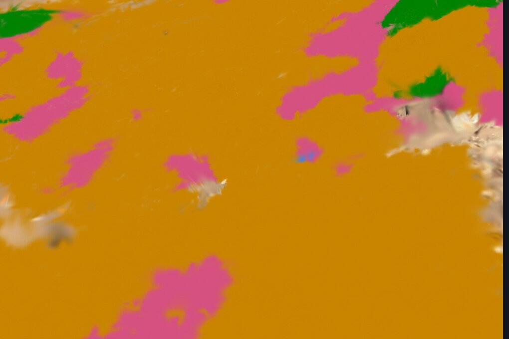
  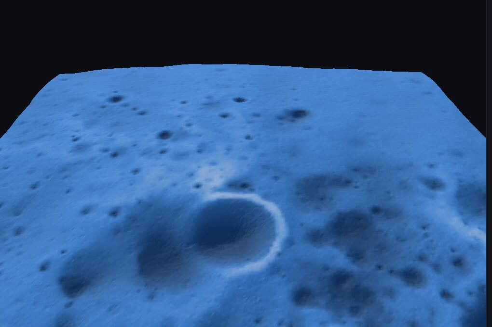

### SpatialMind

**🥈 2nd place, Agentic AI track, JacHacks 2026 at Michigan** · [Source](https://github.com/Matusvec/spatialMind)

Real rooms rebuilt as 5.2 million semantic Gaussians, then queried in plain language: ask for the chair by the window and the scene points to it. Built and presented against 70+ teams.

  
  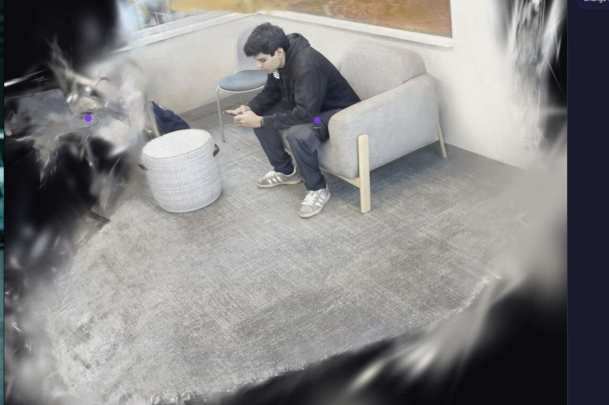
  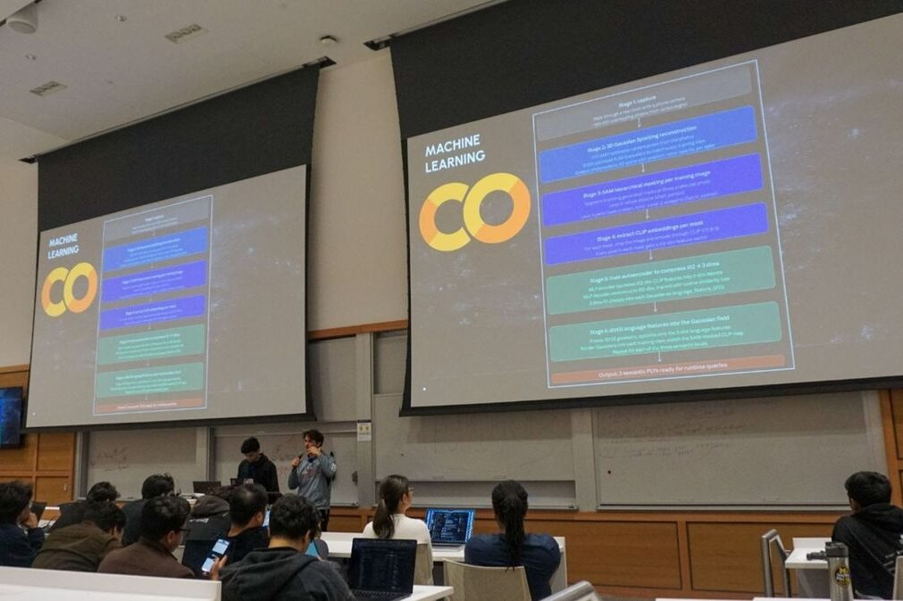

- **Reconstruction.** Scenes are captured on a phone, posed with COLMAP, and trained as 3D Gaussian splats.
- **Semantics on every Gaussian.** LangSplat embeds CLIP features at three scales from SAM masks: whole objects, parts, and fine subparts.
- **The query pipeline.** Text becomes a 512-d CLIP vector, is scored against every Gaussian with LERF-style relevancy, and DBSCAN groups the hits into object instances that light up in the 3D viewport.
- **Edit and explore.** "Turn the couch blue" recolors the Gaussians live. An exploration walker catalogs objects and builds a spatial knowledge graph (left of, above, behind, near).
- **An agent on top.** Questions like "what furniture is near the window?" route to a tool-calling agent that composes several scene lookups.

`PyTorch` `OpenCLIP` `SAM` `COLMAP` `LangSplat` `FastAPI` `React` `Three.js`

### Sharks & Minnows

**Multi-agent reinforcement learning** · [Source](https://github.com/Matusvec/sharks-and-minnows-rl)

One policy controls a team of ten minnows that have to cross a field past a shark that is faster than nine of them. The slow minnows cannot outrun it, so the only way to save everyone is to coordinate.

  

- **Decoy behaviour emerged on its own.** No reward term tells the fast minnow to act as a decoy. The policy learned it: the fast minnow runs to one sideline, the shark follows, and the nine slow minnows cross on the far side.
- **The policy** is a centralized, permutation-equivariant transformer. Each minnow is a token, with 2 self-attention layers, 4 heads, 64-d embeddings, and two critics (team value and per-minnow value).
- **Training** is PPO with GAE, KL early stopping, and rollback when validation collapses, on a curriculum that slows the minnows only after the policy passes a performance gate.
- **The simulator** is fully vectorized in PyTorch and steps 512 games at once on a laptop RTX 5070.
- **Results.** A perfect 10/10 game in 98.1% of 1,024 fixed-seed validation games at the starting difficulty, and 78.5% at the hardest speed solved. Below that, training settles on a "sacrifice one" local optimum that saves nine of ten. The repo documents every attempt to break it.

`PyTorch` `PPO` `Transformer policy` `Curriculum learning`

  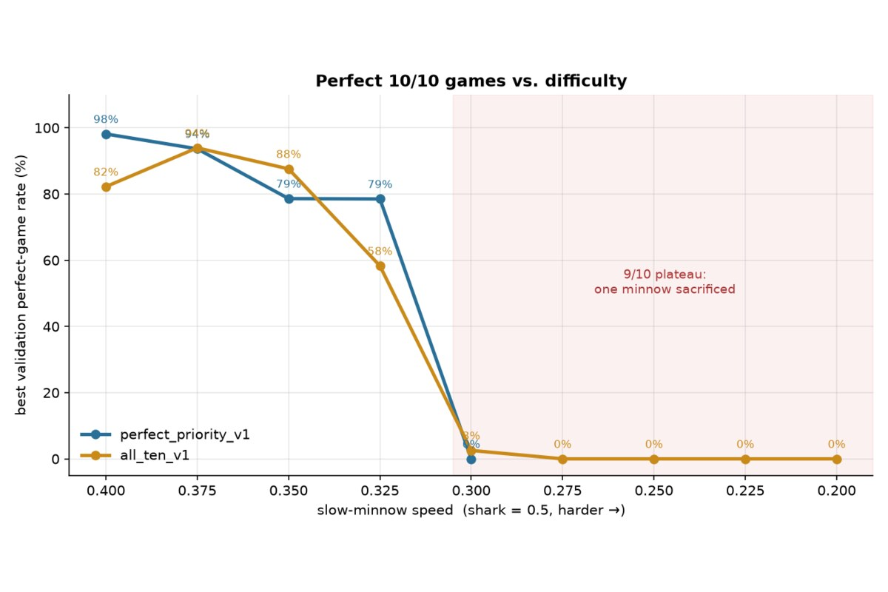
  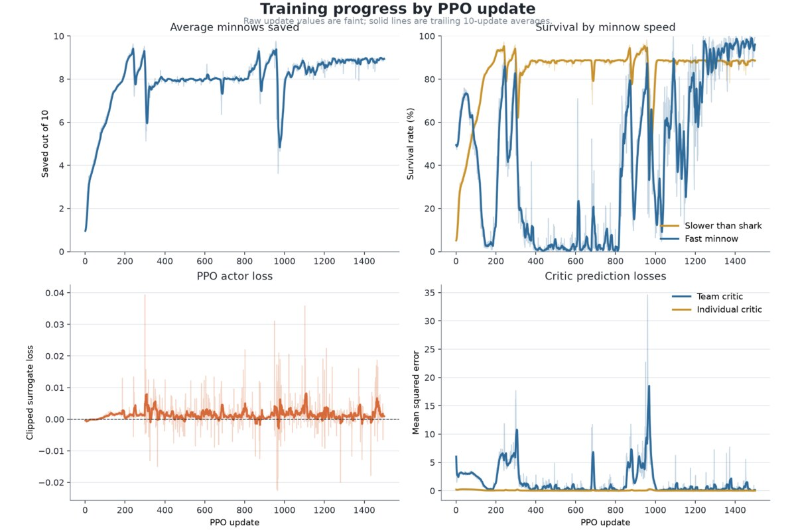

### Volana

**🥇 1st place, Anthropic Claude track, WildHacks 2026 at Northwestern** · [Source](https://github.com/Matusvec/volpath)

Draw where you think a stock is going and see what your option is worth at every point along the path, including the moment volatility crushes on earnings day. Built and presented alone in 24 hours against full teams.

  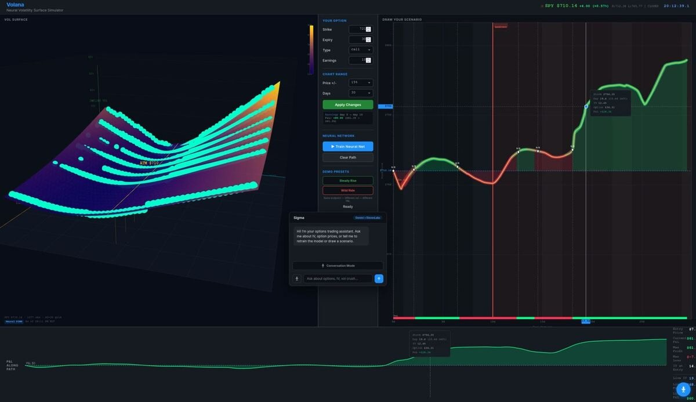

- **A neural volatility surface.** A physics-informed network (four hidden layers of 128 units, about 50,000 parameters) learns implied volatility as a continuous function of strike and maturity from about 1,000 live SPY option quotes.
- **No-arbitrage enforced in the loss.** The butterfly and calendar conditions are computed with `torch.autograd` and penalized during training. The final surface has zero butterfly and calendar violations.
- **Measured against SABR,** the 30-year industry standard: 93% lower error across every fold.
- **A scenario engine.** Every point on the drawn path is repriced with a sticky-moneyness vol lookup, a path-dependent vol regime, an earnings vol crush, and Black-Scholes, fast enough to update while you draw.
- **A live data pipeline.** Quotes are pulled from the market, inverted to implied vol with Brent root-finding, and cleaned of outliers per expiry before training.

`PyTorch` `autograd` `SciPy` `FastAPI` `Three.js`

  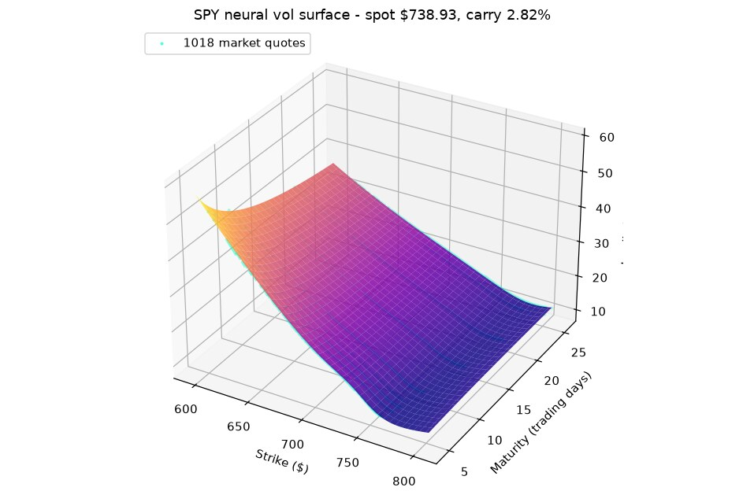
  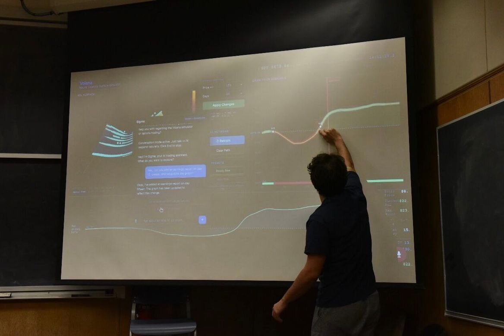
  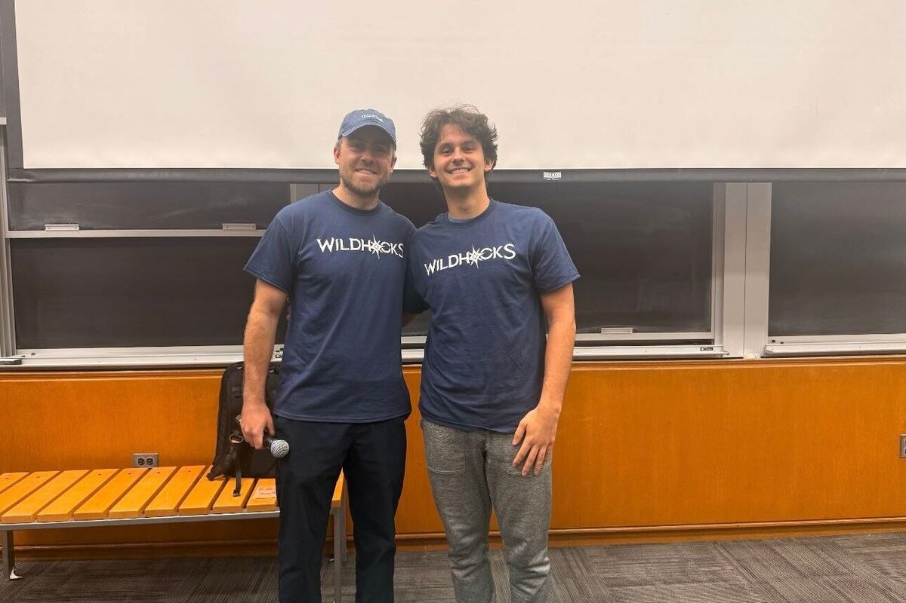

### vecEngine

**C++17 and OpenGL 3.3, from scratch** · [Source](https://github.com/Matusvec/vecEngine)

A single-binary 3D engine and flight simulator on raw OpenGL, with no engine, scene graph, or asset library underneath: just GLFW, GLAD, and GLM. Lift, drag, thrust, and gravity are integrated every frame from aircraft state, so the aircraft flies because the physics says so. It holds 60+ FPS on a single thread.

  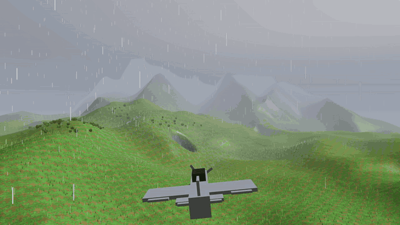

- **Procedural terrain.** Value-noise FBM, ridged multifractal peaks, and domain warping, with biomes that blend by altitude from sand to snow.
- **Chunk streaming.** A fixed ring of chunks with modular slot indexing, so crossing a chunk boundary regenerates only one row or column.
- **Culling.** Frustum and fog-distance culling with bounding spheres, using Gribb–Hartmann plane extraction.
- **Lighting.** Phong shading and a 2048² shadow map with 3×3 PCF. The shadow camera is texel-snapped to stop shimmering.
- **GPU instancing.** Grass and shrubs are instanced, with wind animated in the vertex shader.
- **A game on top.** A ring course, balloons to shoot down, missiles that blow craters in the terrain, water, rain, and a procedural sky.
- **BLACKBOX.** A second app on the same engine: an airfield with a ground model, takeoff roll, stall and landing, 5 Hz UDP telemetry, and an injectable aileron actuator failure.
- **Tested headless.** Unit tests run with no GL context.

`C++17` `OpenGL 3.3` `GLSL` `GLFW` `GLM` `CMake`

  
  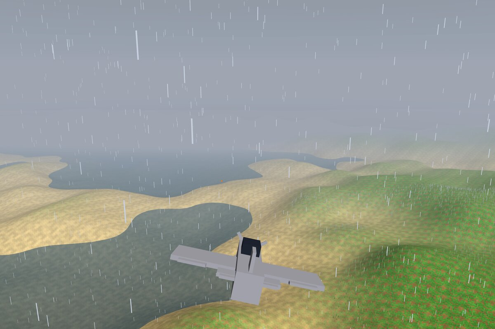
  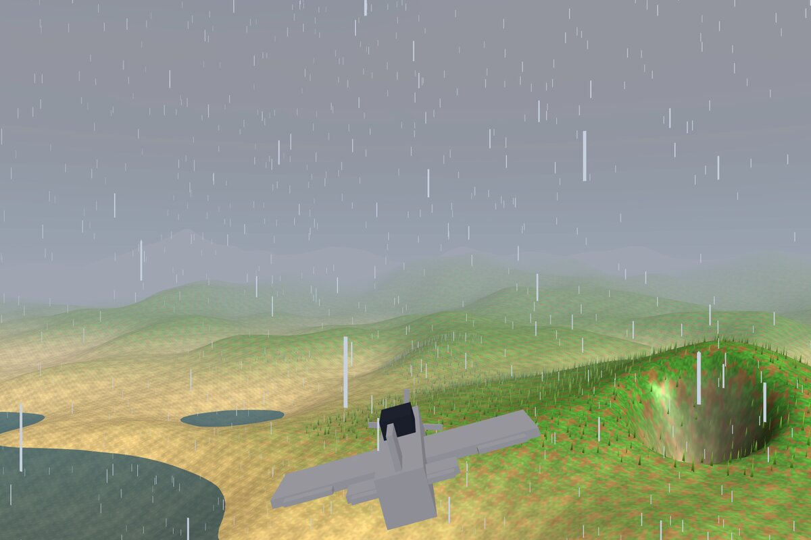

  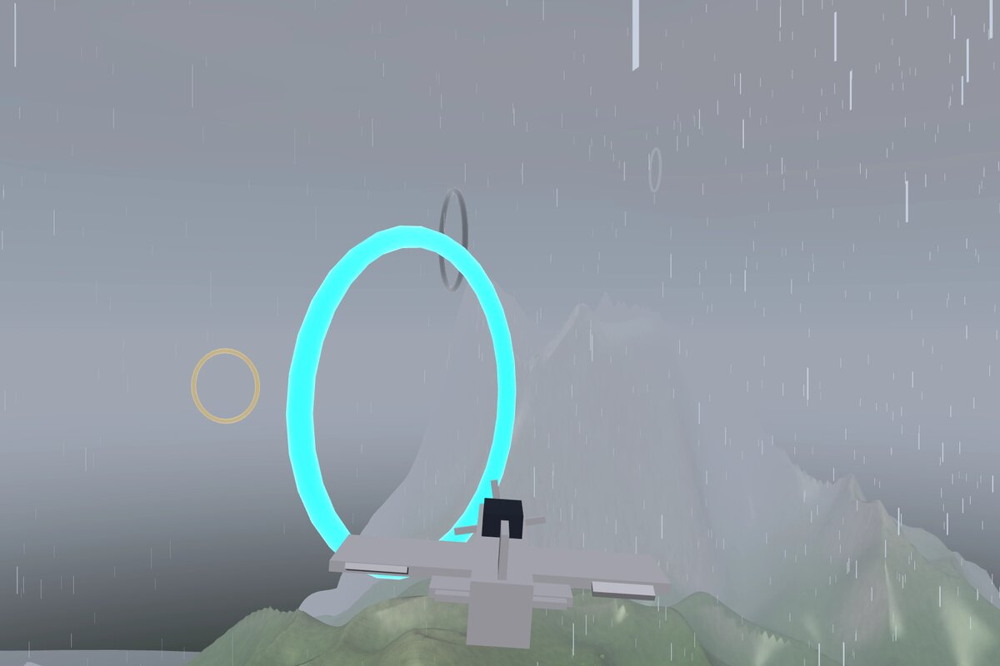
  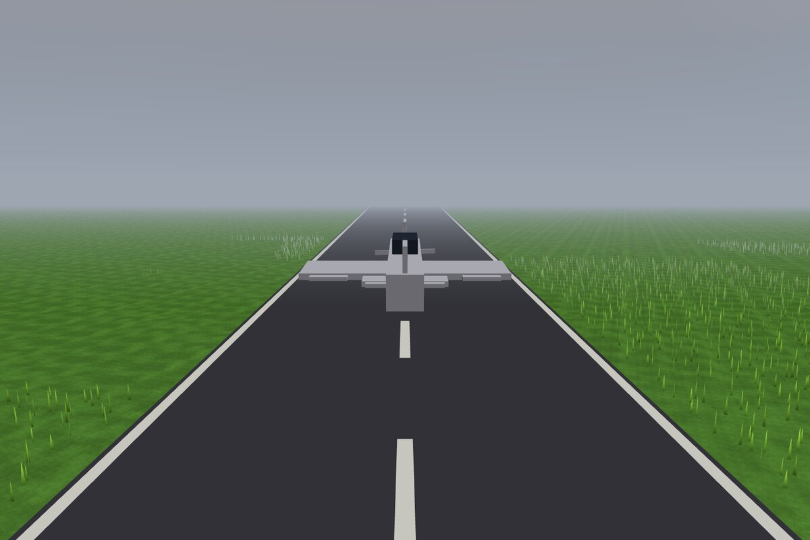
  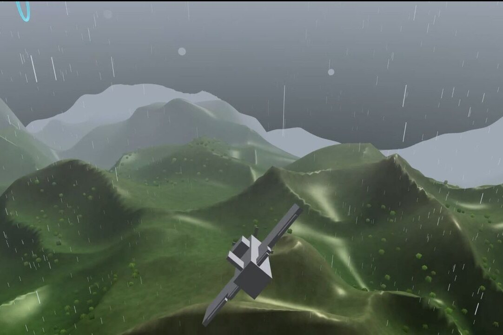

### Ember

**🥇 1st place overall, Hesburgh Hackathon 2026** · [Source](https://github.com/Matusvec/ember)

A userspace input driver for people who can't use a mouse or keyboard. A standard webcam decodes facial expressions, head motion, and finger movements, and the driver injects them into the Linux kernel as real input events, so the whole OS and any application work hands-free. Built with a team of four.

  
  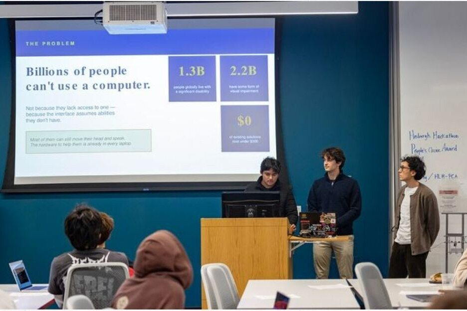
  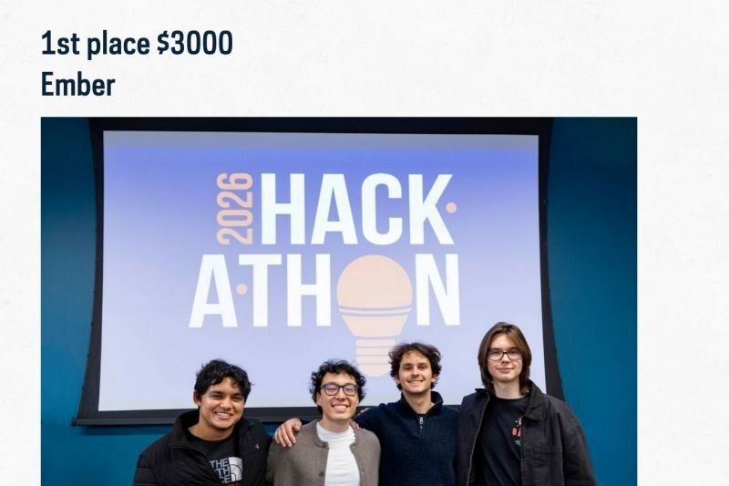

- **Kernel-level input.** Events go through `/dev/uinput` as a virtual mouse and keyboard, so nothing needs to know Ember exists.
- **A tight loop.** Perception to action runs at 30 FPS inside a 33 ms frame budget.
- **Per-user profiles.** Onboarding maps whatever movements someone can reliably make to actions. Profiles hot-reload, so a changed binding takes effect on the next frame.
- **A voice agent.** A wake word opens a conversational agent that can launch apps, search the web, type, and click. Half-duplex audio keeps it from answering its own speech.
- **A dwell keyboard.** An on-screen keyboard types after 600 ms of cursor dwell through a second `uinput` device, so focus stays in the target app.

`Python` `MediaPipe` `OpenCV` `Linux uinput` `evdev` `FastAPI`

### 8-bit CPU and hardware divider

**Digital logic, from gates**

A complete 8-bit CPU and a hardware divider designed from raw gates in Logisim: ALUs, register files, datapaths, and FSM controllers, wired by hand. I'm porting the CPU to Verilog for FPGA.

  
  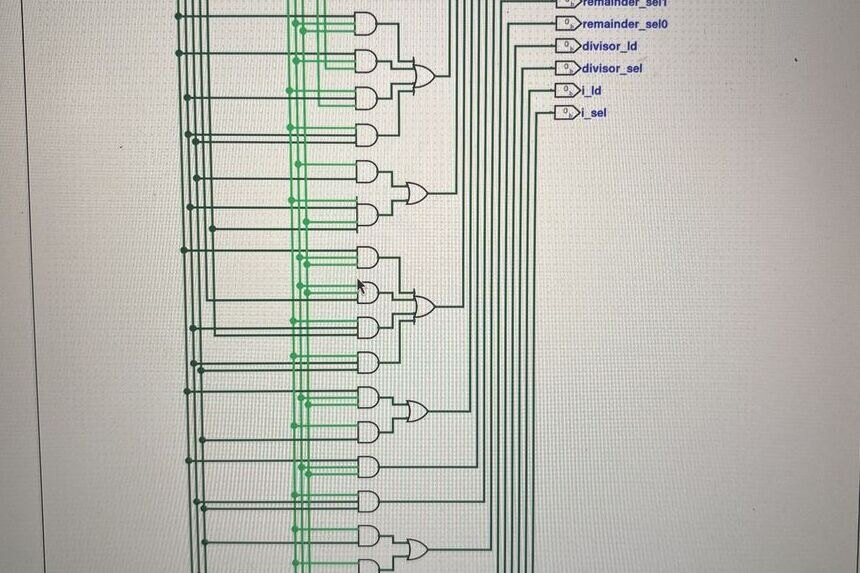

  
  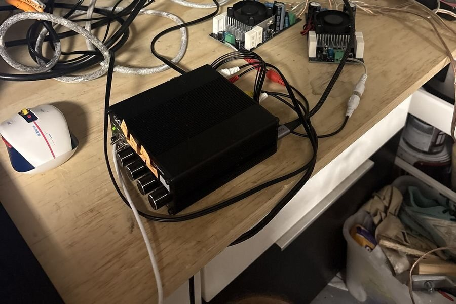
  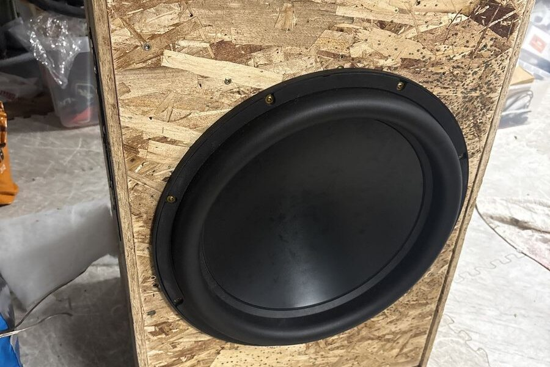

### Sentinel

**🏅 Best Use of MongoDB, RocketHacks 2026** · [Source](https://github.com/Matusvec/baseSentinel)

A ~$150 Python and Arduino perception station. Vision models drive PID-controlled pan/tilt tracking, fused with ultrasonic and IR sensors. It detects people and falls, recognizes known faces, and takes plain-English missions that reconfigure the perception pipeline.

### Audio chain

A SigmaDSP active crossover driving an amplifier stack and a subwoofer I built.

- [Label Check](https://github.com/Matusvec/ttb-label-verifier): checks alcohol label images against their application data and sorts each one into approved, rejected, or needs review. [Live demo](https://ttb-label-verifier-two.vercel.app)
- [aunalyticsNLSQL](https://github.com/Matusvec/aunalyticsNLSQL): turns plain-English questions into validated, read-only SQL, with a local LLM first and a cloud fallback.
- [Liberation Trader](https://liberationtraders.com): an AI research desk for self-directed investors.

  <a href="https://matusvec.github.io">Portfolio</a> · <a href="https://linkedin.com/in/mvecera">LinkedIn</a> · <a href="mailto:mvecera@nd.edu">mvecera@nd.edu</a>

