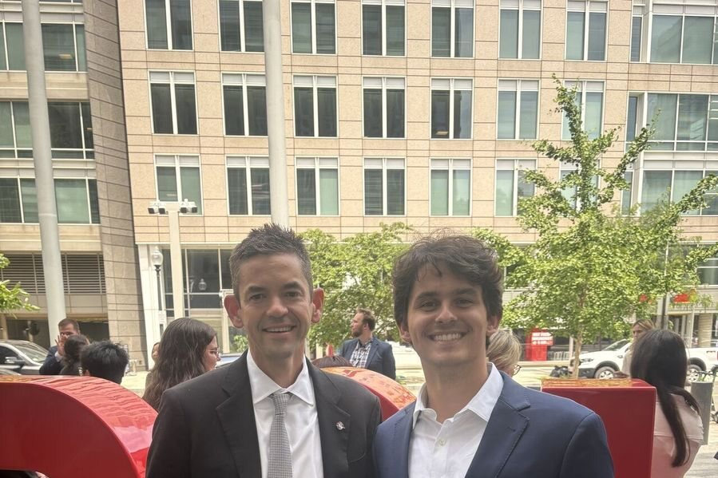
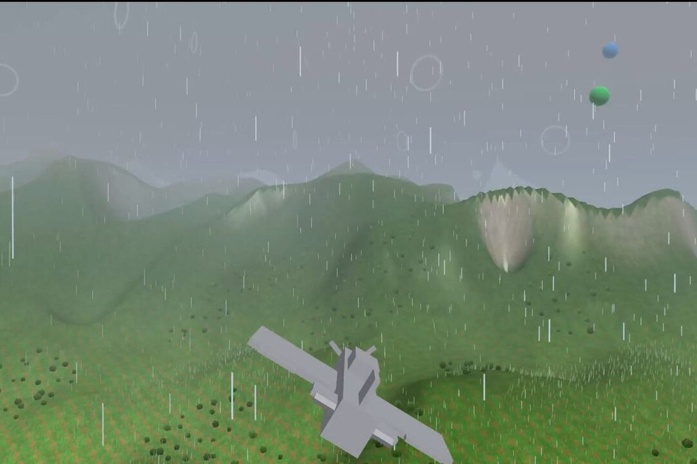

  

  
  
  

I study computer science and physics at Notre Dame, class of 2029. I build systems that have to work in the real world: production software at NASA, a flight simulator written from the GPU up, an input driver that lets people run Linux with their face, and hardware when the problem calls for it.

<table>
  <tr><td>🚀 <b>NASA Headquarters</b></td><td>Sole engineer on an analytics system used by analysts across every NASA center</td></tr>
  <tr><td>🥇 <b>1st place overall</b></td><td>Hesburgh Hackathon 2026, with <a href="#ember">Ember</a></td></tr>
  <tr><td>🥇 <b>1st place, Anthropic Claude track</b></td><td>WildHacks 2026 at Northwestern, with <a href="#volana">Volana</a>, built solo</td></tr>
  <tr><td>🥈 <b>2nd place, Agentic AI track</b></td><td>JacHacks 2026 at Michigan, with <a href="#spatialmind">SpatialMind</a></td></tr>
  <tr><td>🏅 <b>Best Use of MongoDB</b></td><td>RocketHacks 2026, with <a href="#hardware">Sentinel</a></td></tr>
</table>

## NASA Headquarters

**Summer 2026, Washington, DC**

I was the sole engineer on EDAQ, an analytics system now used by analysts across every NASA center. It answers plain-language questions over agency workforce data with grounded, cited results. I cut end-to-end latency by 41% and took it through an independent security audit before rollout. Along the way I was flown from the Ames supercomputer to the Hubble control room at Goddard.

  
  

## Featured projects

### Ember

**🥇 1st place overall, Hesburgh Hackathon 2026** · [Source](https://github.com/Matusvec/ember)

A userspace input driver for people who can't use a mouse or keyboard. A standard webcam decodes facial expressions, head motion, and finger movements, and the driver injects them into the Linux kernel through `/dev/uinput` as real input events, so the whole OS and any application work hands-free. Per-user profiles map whatever movements someone can reliably make. The perception-to-action loop runs at 30 FPS inside a 33 ms frame budget. Built with a team of four.

`Python` `MediaPipe` `OpenCV` `Linux uinput` `FastAPI`

  
  

### Volana

**🥇 1st place, Anthropic Claude track, WildHacks 2026 at Northwestern** · [Source](https://github.com/Matusvec/volpath)

Draw where you think a stock is going and see what your option is worth at every point along the path, including when volatility crushes on earnings day. Underneath is a neural volatility surface with the no-arbitrage conditions enforced as penalties in the training loss: zero butterfly and calendar violations, and 93% lower error than the SABR baseline across every fold. Built and presented alone in 24 hours against full teams.

`PyTorch` `Physics-informed neural network` `Options pricing`

  
  

### vecEngine

**C++17 and OpenGL 3.3, from scratch** · [Source](https://github.com/Matusvec/vecEngine)

A single-binary 3D engine and flight simulator on raw OpenGL, with no engine, scene graph, or asset library underneath. Lift, drag, thrust, and gravity are integrated every frame from aircraft state, so the aircraft flies because the physics says so. Streamed chunked terrain, frustum culling, and GPU instancing hold 60+ FPS on a single thread.

`C++17` `OpenGL 3.3` `GLFW` `GLM`

  
  

### Planetary Scene Studio

**MHacks 2026, SpaceX challenge** · [Source](https://github.com/Matusvec/spaceX-Mhacks-Challenge) · [Live](https://planetary-scene-studio.vercel.app)

Plan a base on Mars or the Moon on the real ground, together. A Gaussian splat of 972,047 Gaussians, trained from 241 Perseverance rover photos of Cheyava Falls in Jezero Crater, sits on 2 km of HiRISE orbital terrain in the same metric frame. A team can place habitats, drive a rover, and share concept renders in one live session. Built with two teammates.

`TypeScript` `Gaussian splatting` `SpacetimeDB` `Grok`

  
  

### SpatialMind

**🥈 2nd place, Agentic AI track, JacHacks 2026 at Michigan** · [Source](https://github.com/Matusvec/spatialMind)

Real rooms rebuilt as 5.2 million semantic Gaussians with a COLMAP, SAM, and CLIP pipeline, then queried in plain language: ask for the chair by the window and the scene points to it. Built and presented against 70+ teams.

`Python` `Gaussian splatting` `CLIP` `SAM` `COLMAP` `React`

  
  

### Sharks & Minnows

**Multi-agent reinforcement learning** · [Source](https://github.com/Matusvec/sharks-and-minnows-rl)

One attention-based policy controls ten minnows that have to cross a field past a shark that is faster than nine of them. Nothing in the reward tells the fast minnow to act as a decoy. The policy learned it: the fast minnow draws the shark to one sideline while the slow ones cross on the other. It plays a perfect game in 98.1% of 1,024 fixed-seed validation games at the starting difficulty. Trained with PPO on a GPU-vectorized PyTorch simulator running 512 games at once.

`PyTorch` `PPO` `Attention policy` `Curriculum learning`

  

## Hardware

[Sentinel](https://github.com/Matusvec/baseSentinel) is a ~$150 Python and Arduino perception station: vision models drive PID-controlled pan/tilt tracking, fused with ultrasonic and IR sensors. It won Best Use of MongoDB at RocketHacks 2026. I also designed a complete 8-bit CPU and a hardware divider from raw gates in Logisim (ALUs, register files, datapaths, and FSM controllers, wired by hand) and am porting the CPU to Verilog for FPGA. The rest is my audio chain: a SigmaDSP active crossover driving an amplifier stack and a subwoofer I built.

  
  

## More

- [Label Check](https://github.com/Matusvec/ttb-label-verifier): checks alcohol label images against their application data and sorts each one into approved, rejected, or needs review. [Live demo](https://ttb-label-verifier-two.vercel.app)
- [aunalyticsNLSQL](https://github.com/Matusvec/aunalyticsNLSQL): turns plain-English questions into validated, read-only SQL, with a local LLM first and a cloud fallback.
- [Liberation Trader](https://liberationtraders.com): an AI research desk for self-directed investors.

  <a href="https://matusvec.github.io">Portfolio</a> · <a href="https://linkedin.com/in/mvecera">LinkedIn</a> · <a href="mailto:mvecera@nd.edu">mvecera@nd.edu</a>

